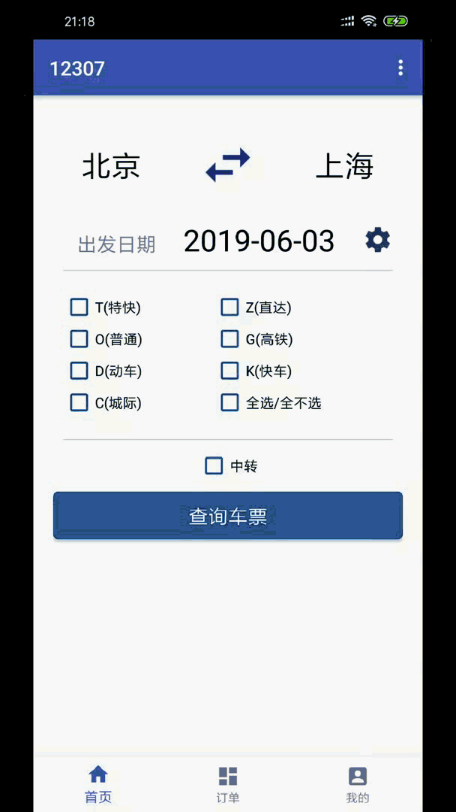
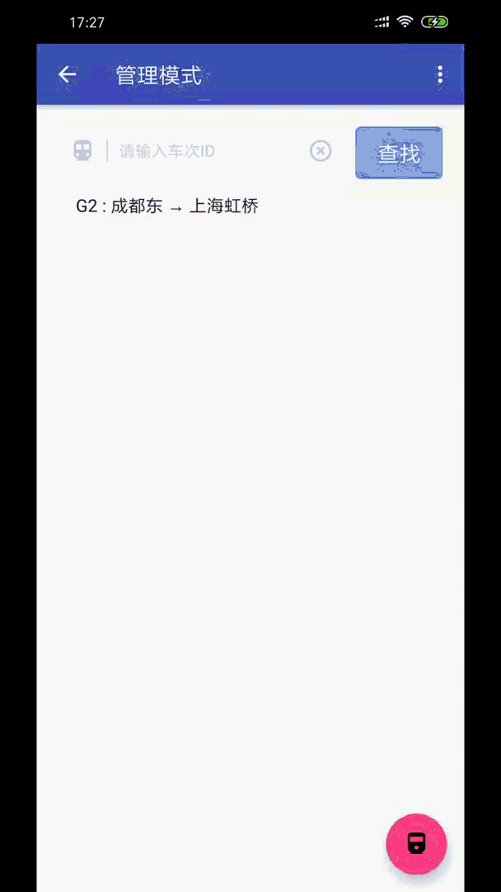
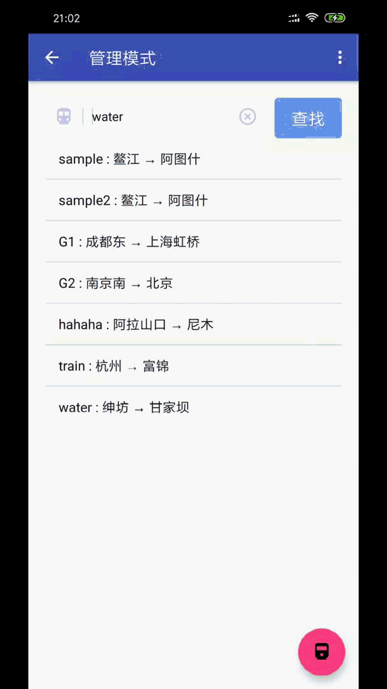

### 如何安装

下载后直接安装即可。

### 如何使用

##### 用户手册

1. 登录与注册  

2. 登出与权限测试  
只有管理员才可以进入管理模式。普通用户进入管理模式将显示无权限。  

3. 修改用户信息  

4. 查票与购票  

5. 带中转查票  

6. 退票  

##### 管理手册

1. 从管理模式修改用户信息  

2. 删库  

3. 退出后端  

4. 增加/修改车次  

5. 发售与删除车次  

